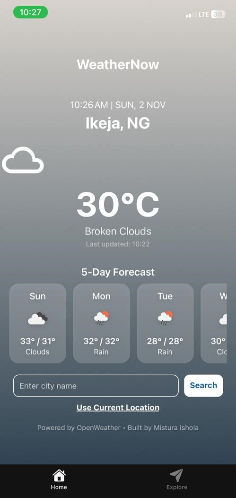
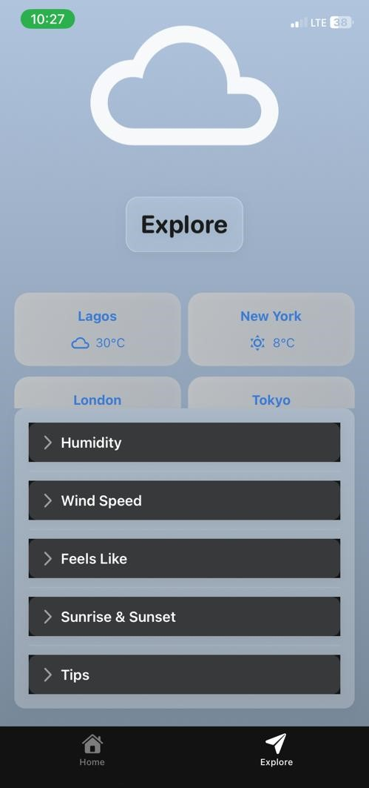

# React Native Weather App 🌤️

This is an [Expo](https://expo.dev) project created with [`create-expo-app`](https://www.npmjs.com/package/create-expo-app).

A cross-platform mobile weather app built with React Native and Expo, displaying current weather and forecasts for your city and popular cities. 
Built by **Mistura Ishola** using the **OpenWeather API**


# Live Demo

Open the app in **Expo Go**: https://expo.dev/accounts/misturadev/projects/weather-app


# Features

- Search weather by city name 🌆

- Fetch weather for current location 📍

- 5-day forecast at midday ☀️

- Animated weather icons with gradients 🎨

- Weather tips based on conditions 💡


## Screenshots

### Home Screen


### Explore Screen



## Get started

1. Install dependencies

   ```bash
   npm install
   ```

2. Start the app

   ```bash
   npx expo start
   ```

   You can open the app in:

- [Expo Go](https://expo.dev/go), a limited sandbox for trying out app development with Expo
- [Android emulator](https://docs.expo.dev/workflow/android-studio-emulator/)
- [iOS simulator](https://docs.expo.dev/workflow/ios-simulator/)
- [development build](https://docs.expo.dev/develop/development-builds/introduction/)

3. Set up your API key:

  - Rename app/config/apiKey.example.ts 

  - Replace the dummy key with your OpenWeather API key:

   ```bash
   export const OPENWEATHER_API_KEY = "YOUR_REAL_API_KEY_HERE";
   ```

# Developer

**Mistura Ishola**
